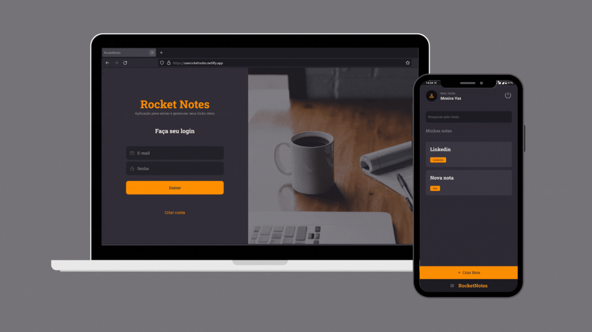

<div align="center">
<h1>RocketNotes - API</h1>
Um lugar na web para guardar seus links e anotações! 
<br> <br>

A API foi desenvolvida durante o programa Explorer da Rocketseat.

Clique <a href="https://userocketnotes.netlify.app/" target="_blank">aqui</a> para acessar a aplicação!

### Preview



### Setup

**Clone o projeto e acesse a pasta**

```bash
git clone https://github.com/M0nicaVaz/RocketNotes-api.git && cd RocketNotes-api
```

**Siga os passos abaixo**

```bash
# Instale as dependências
$ npm ou yarn install

# Rode o servidor
$ npm run dev
```

### Tech Stack

O projeto foi desenvolvido com [Node](https://nodejs.org/en/), [Knex](http://knexjs.org/) e [SQLite](https://www.sqlite.org/index.html) no **server-side**, [React](https://reactjs.org/) e [Styled-Components](https://styled-components.com/) no **client-side**.

Clique <a href="https://github.com/M0nicaVaz/RocketNotes" target="_blank">aqui</a> para acessar o repositório do front!

Com 💜 por <a href="https://www.linkedin.com/in/monica-vaz/" target="_blank"> Monica Vaz </a>

</div>
